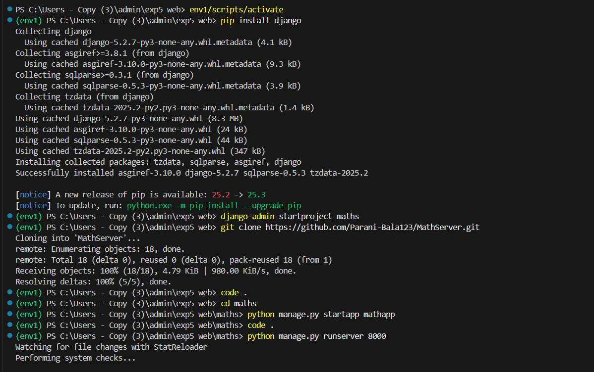
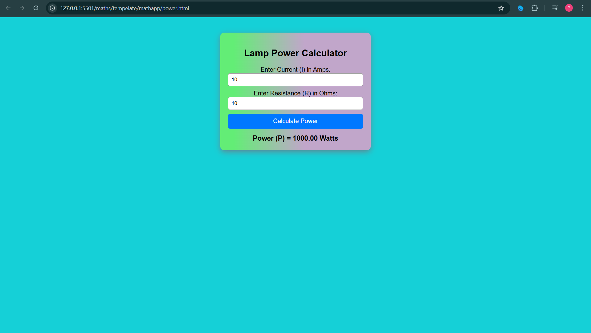

# Ex.05 Design a Website for Server Side Processing
## Date: 1/11/2025

## AIM:
 To design a website to calculate the power of a lamp filament in an incandescent bulb in the server side. 


## FORMULA:
P = I<sup>2</sup>R
<br> P --> Power (in watts)
<br> I --> Intensity
<br> R --> Resistance

## DESIGN STEPS:

### Step 1:
Clone the repository from GitHub.

### Step 2:
Create Django Admin project.

### Step 3:
Create a New App under the Django Admin project.

### Step 4:
Create python programs for views and urls to perform server side processing.

### Step 5:
Create a HTML file to implement form based input and output.

### Step 6:
Publish the website in the given URL.

## PROGRAM :
```
power.html

<!DOCTYPE html>
<html>
<head>
<center>
    <title>Lamp Power Calculator</title>
    <style>
        body {
            font-family: Arial, sans-serif;
            margin: 40px;
            background: rgb(21, 208, 215);
        }
        .container {
            background: linear-gradient(90deg, rgb(99, 237, 118) 9%, rgb(193, 166, 202) 56%);
            width: 350px;
            padding: 20px;
            border-radius: 10px;
            box-shadow: rgba(239, 5, 24, 0.35) 0px 5px 15px;
        }
        input {
            width: 95%;
            padding: 8px;
            margin-bottom: 10px;
            border-radius: 5px;
            border: 1px solid gray;
        }
        button {
            width: 100%;
            padding: 10px;
            background: #0078ff;
            border: none;
            color: white;
            font-size: 16px;
            border-radius: 5px;
        }
        #result {
            margin-top: 15px;
            font-size: 18px;
            font-weight: bold;
        }
    </style>
</head>

<body>

<div class="container">
    <h2>Lamp Power Calculator</h2>

    <label>Enter Current (I) in Amps:</label>
    <input type="number" id="current" step="0.01">

    <label>Enter Resistance (R) in Ohms:</label>
    <input type="number" id="resistance" step="0.01">

    <button onclick="calculatePower()">Calculate Power</button>

    <div id="result"></div>
</div>

<script>
function calculatePower() {
    let I = parseFloat(document.getElementById("current").value);
    let R = parseFloat(document.getElementById("resistance").value);

    if (isNaN(I) || isNaN(R)) {
        document.getElementById("result").innerHTML = "⚠️ Please enter valid numbers.";
        return;
    }

    let P = I * I * R;

    document.getElementById("result").innerHTML = "Power (P) = " + P.toFixed(2) + " Watts";
}
</script>

</body>
</center>
</html>

views.py

from django.shortcuts import render

def powerlamp(request):
    context={}
    context['Power'] = ""
    context['I'] = ""
    context['R'] = ""
    if request.method == 'POST':
        print("POST method is used")
        I = request.POST.get('Intensity','')
        R = request.POST.get('Resistence','')
        print('request=',request)
        print('Intensity=',I)
        print('Resistence=',R)
        Power = int(I) * int(I) * int(R)
        context['Power'] = Power
        context['I'] = I
        context['R'] = R
        print('Power=',Power)
    return render(request,'mathapp/power.html',context)

urls.py

from django.contrib import admin
from django.urls import path
from mathapp import views
urlpatterns = [
    path('admin/', admin.site.urls),
    path('PowerOfLampFilamentInAnIncandescentBulb/',views.powerlamp,name="PowerOfLampFilamentInAnIncandescentBulb"),
    path('',views.powerlamp,name="PowerOfLampFilamentInAnIncandescentBulb")
    ]

```

## SERVER SIDE PROCESSING:



## HOMEPAGE:



## RESULT:
The program for performing server side processing is completed successfully.
